# 💼 CareerConnect — MERN Job Portal Web App

CareerConnect is a full-stack job portal application built using the **MERN stack (MongoDB, Express, React, Node.js)**. It allows recruiters to post jobs and manage applicants, while job seekers can browse listings and apply to opportunities. This project was built by following a complete tutorial as part of my learning journey in full-stack development.

---

## 🚀 Features

- 👨‍💼 Recruiter and Applicant role-based authentication (JWT)
- 📝 Job posting, editing, and deletion by employers
- 📄 Resume submission & job application by candidates
- 📊 Dashboards for recruiters and applicants
- 🔒 Secure routes and role-based access control
- 📱 Responsive design for both desktop and mobile devices

---

## 🛠️ Tech Stack

| Technology | Description                         |
|------------|-------------------------------------|
| **MongoDB** | NoSQL database for job/user data   |
| **Express.js** | Node.js backend framework       |
| **React.js** | Frontend SPA framework            |
| **Node.js** | JavaScript runtime environment     |
| **JWT** | Secure user authentication             |
| **Bootstrap / Tailwind** | UI Styling (based on tutorial) |

---

## 📷 Screenshots

### 🔹 Home Page
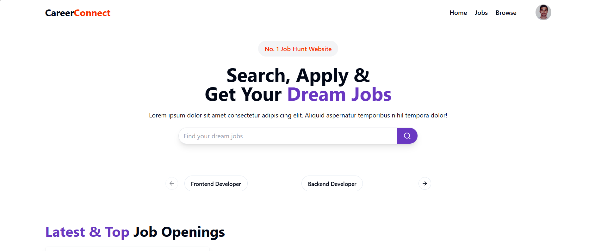
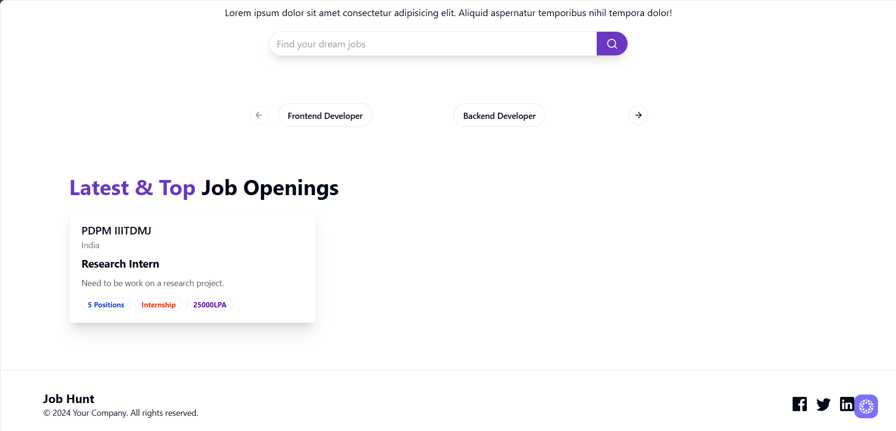

### 🔹 Login Page
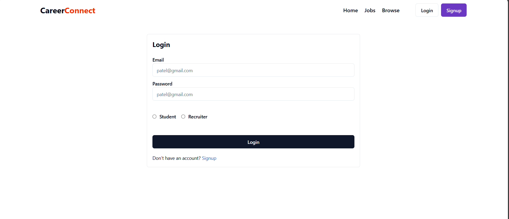

### 🔹 SignUp Page
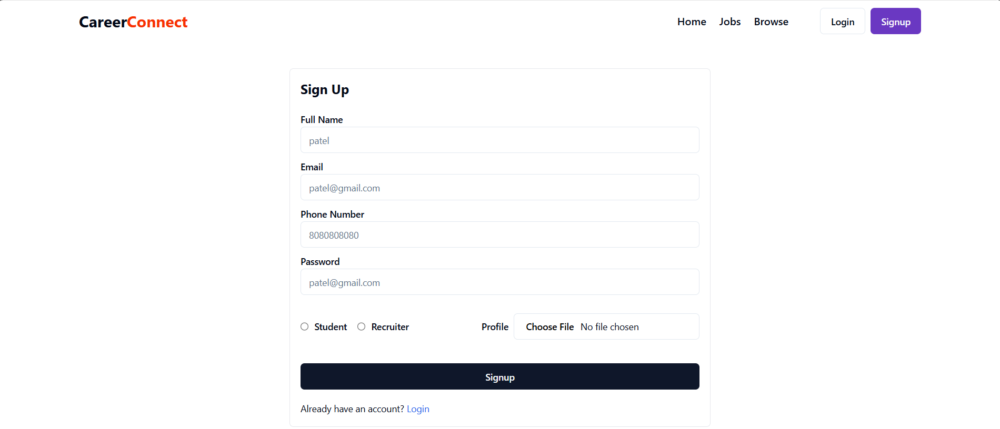

### 🔹 Job Listings
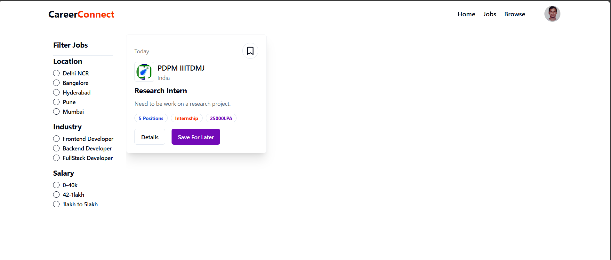

### 🔹 Recruiter Dashboard

### 🔹 New Company
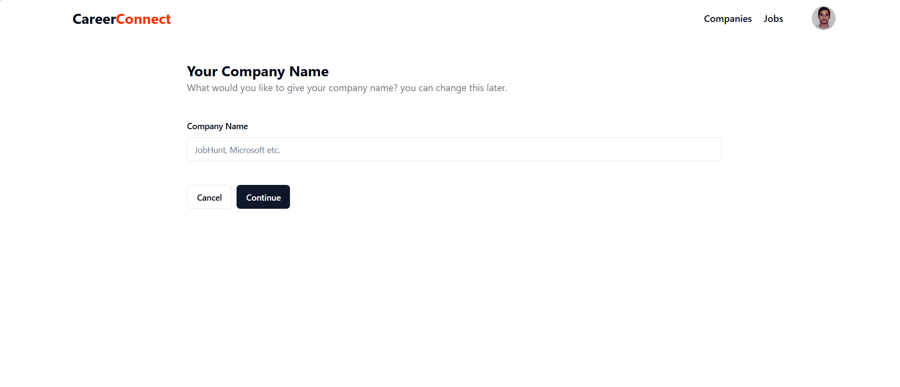
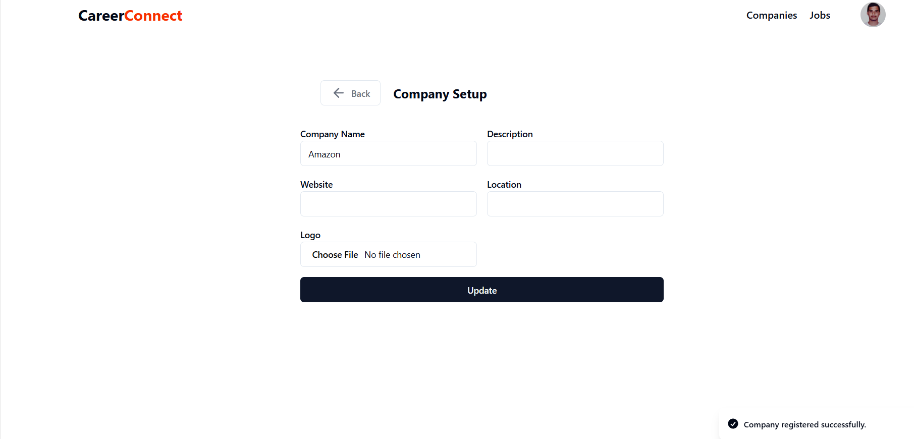

### 🔹 Applicant Dashboard

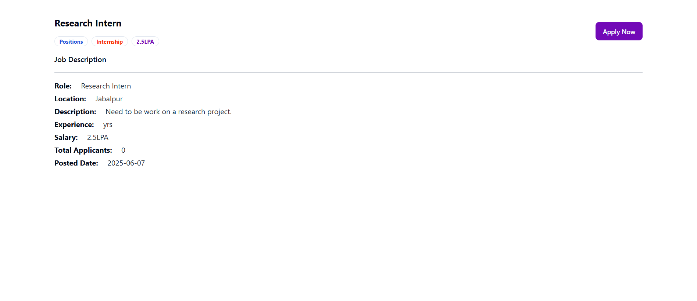

### 🔹 New Job
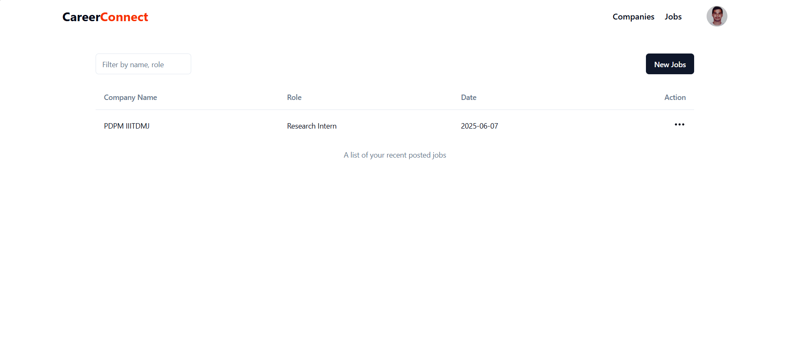
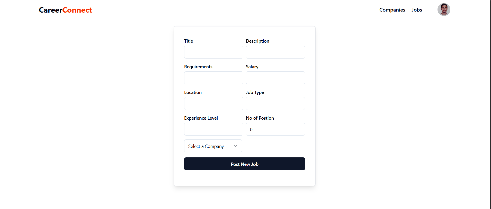

### 🔹 Browse Sections
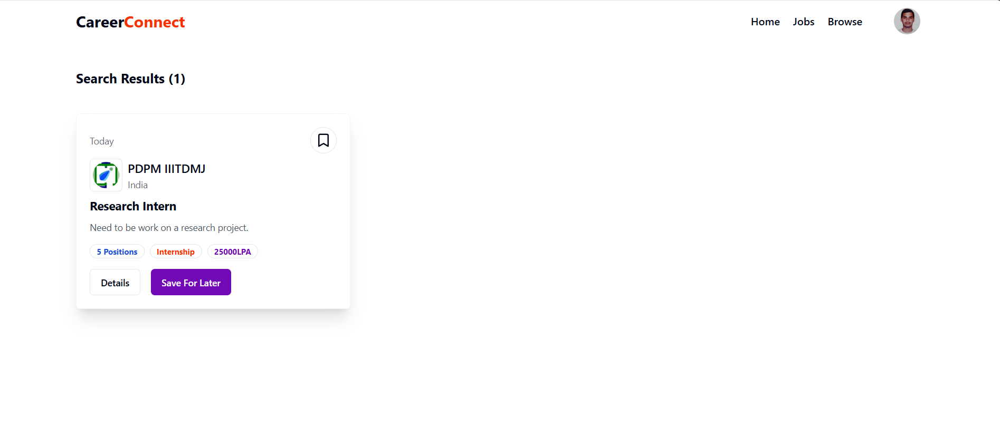

## 📌 Future Enhancements

- 💳 Payment integration for premium job listings
- 🔎 Search and filter by category, location, or company
- 📩 Email notifications on job application
- 📊 Admin analytics dashboard for job metrics

